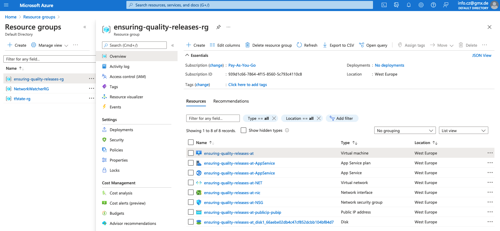

# Ensuring-Quality-Releases

* [Overview](#overview)
* [Terraform](#terraform)
* [Azure DevOps](#azure-devops)
* [Postman](#postman)
* [JMeter](#jmeter)
* [Selenium](#selenium)
* [Azure Monitor](#azure-monitor)

## Overview
This project is part of the Udacity Cloud DevOps using Microsoft Azure Nanodegree Program.

This project is about creating disposable test environments and run a variety of automated tests with the click of a button in addition to monitoring and providing insight into the application's behavior and determining root causes by querying the application’s custom log files.


The following technology stack will be used:
- Azure DevOps for creating a CI/CD pipline to run Terraform and execute tests with Postman, JMeter & Selenium.
- Azure App Services to host the web application
- Azure Pipelines to provision, build, deploy and test the web application
- Terraform for creating and deploying Azure cloud infrastructure (IaC)
- Postman for integration testing
- JMeter for performance testing
- Selenium for functional UI testing
- Azure Monitor for observability purposes

In terms of a process flow, one can think of:
1. Development (VS Code)
2. Code Repository (GitHub)
3. Provisioning (Terraform)
4. Building (Azure Pipelines)
5. Deploying (Azure Pipelines)
6. Integration Testing (Postman)
7. Stress Testing (JMeter)
8. UI Testing (Selenium)
9. Observing (Azure Monitor & Azure Log Analytics)

The automated tests (Integration, UI and Stress) run on a self-hosted virtual machine (Linux).

<br/>

## Terraform
### Configuration of storage account and state backend

<br/>

Login to Azure CLI:
```
az login
```

Specify subscription to use:
```
az account set --subscription="939d1c66-7864-4f15-8560-5c793c4110c8"
```

Configure remote state storage account:\
Create resource group:
```
az group create --name tfstate-rg --location westeurope
```
Create storage account:
```
az storage account create --resource-group tfstate-rg  --name tfstatesa20210913 --sku Standard_LRS --encryption-services blob
```
Create blob container:
```
az storage container create --name tfstate-bc --account-name tfstatesa20210913
```

Configure terraform backend state:
```
ACCOUNT_KEY=$(az storage account keys list --resource-group tfstate-rg --account-name tfstatesa20210913 --query '[0].value' -o tsv)
```

```
ACCOUNT_KEY
```

Output can be found in the main.tf file.

Note: 'key' is the name of the state store file to be created -> terraform.tfstate

Source: [Link](https://docs.microsoft.com/en-us/azure/developer/terraform/store-state-in-azure-storage?tabs=azure-cli)

<br/>

### Creating a Service Principal for Terraform

Create Service Principal:
```
az ad sp create-for-rbac --role="Contributor" --scopes="/subscriptions/939d1c66-7864-4f15-8560-5c793c4110c8" 
```

Output can be found in the terraform.tfvars file.

Source: [Link](https://registry.terraform.io/providers/hashicorp/azurerm/latest/docs/guides/service_principal_client_secret)

<br/>

### Project Steps
Terraform will be used for creating the following resources:
- AppService
- Network
- Network Security Group
- Public IP
- Resource Group
- Linux VM

The terraform resource code for AppService, Network, Network Security Group, Public IP and Resource Group is already provided by Udacity. The terraform resource code for the Linux VM is provided by me. This includes changes in the following terraform files: input.tf, main.tf, terraform.tfvars, vm/input.tf & vm/vm.tf.

Executing terraform:
```
terraform init
```
``
Terraform has been successfully initialized!
``

```
terraform plan -out solution.plan
```
``
Plan: 10 to add, 0 to change, 0 to destroy.
Saved the plan to: solution.plan
``

```
terraform apply "solution.plan" 
```
``
Apply complete! Resources: 10 added, 0 changed, 0 destroyed.
``

Checking on Azure portal if resource group and its services have been successfully created:


<br/>

## Azure DevOps
## Postman
## JMeter
## Selenium
## Azure Monitor