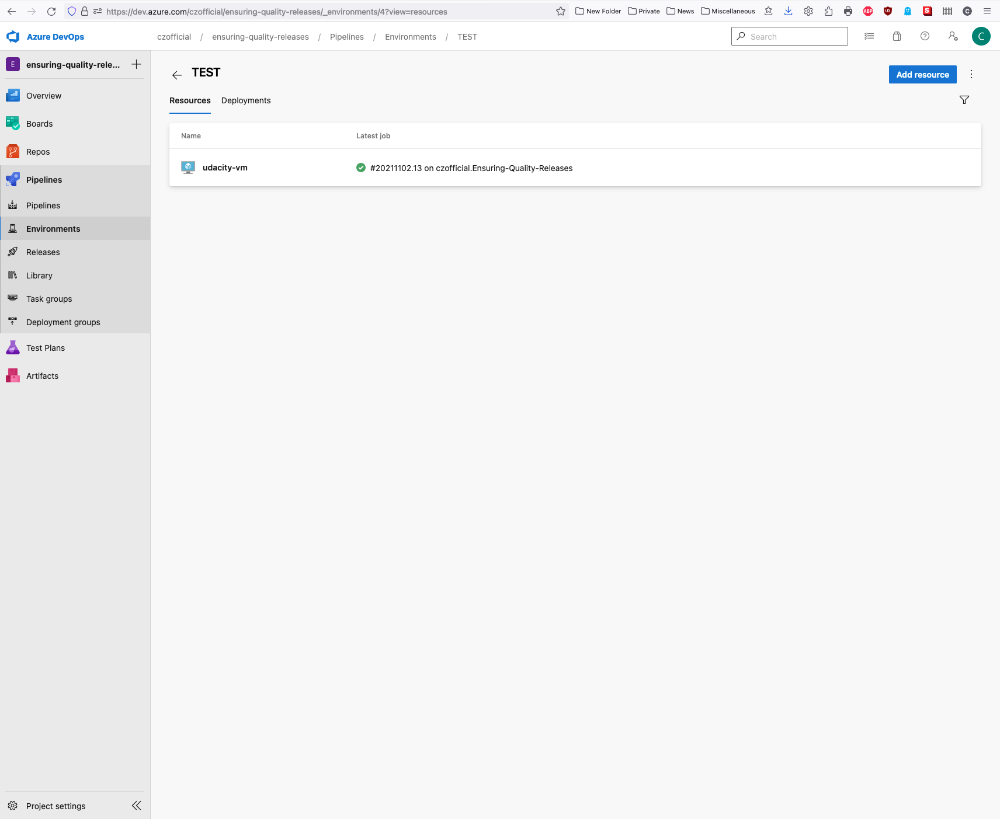
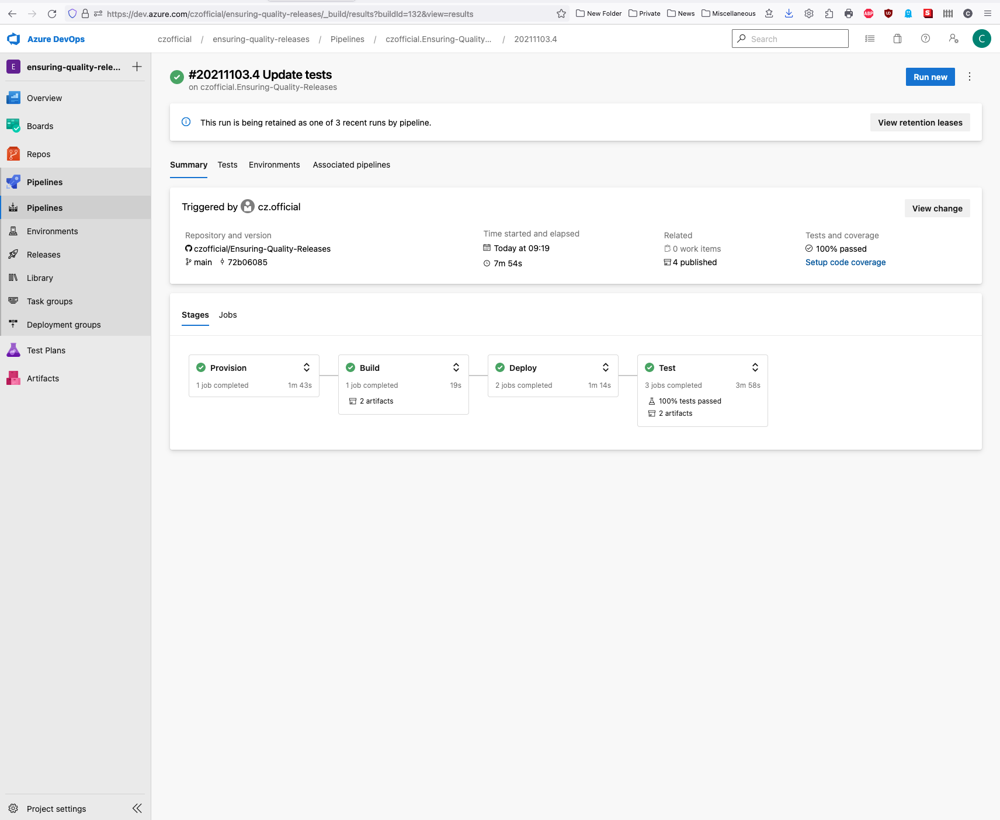
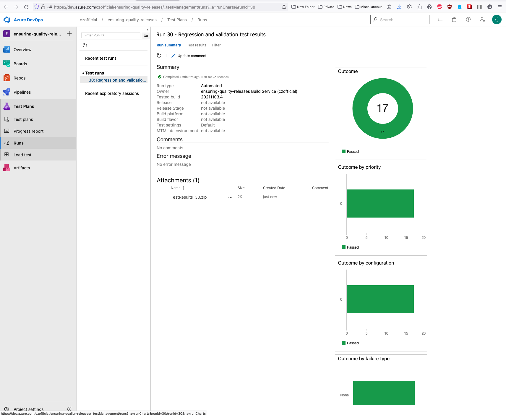

# Ensuring-Quality-Releases

* [Overview](#overview)
* [Terraform](#terraform)
* [Azure DevOps](#azure-devops)
* [Azure Monitor](#azure-monitor)
* [Tests](#tests)

## Overview
This project is part of the Udacity Cloud DevOps using Microsoft Azure Nanodegree Program.

This project is about creating disposable test environments and run a variety of automated tests with the click of a button in addition to monitoring and providing insight into the application's behavior and determining root causes by querying the application’s custom log files.


The following technology stack will be used:
- Azure DevOps for creating a CI/CD pipline to run Terraform and execute tests with Postman, JMeter & Selenium.
- Azure App Services to host the web application
- Azure Pipelines to provision, build, deploy and test the web application
- Terraform for creating and deploying Azure cloud infrastructure (IaC)
- Postman for integration testing
- JMeter for performance testing
- Selenium for functional UI testing
- Azure Monitor for observability purposes

In terms of a process flow, one can think of:
1. Development (VS Code)
2. Code Repository (GitHub)
3. Provisioning (Terraform)
4. Building (Azure Pipelines)
5. Deploying (Azure Pipelines)
6. Integration Testing (Postman)
7. Stress Testing (JMeter)
8. UI Testing (Selenium)
9. Observing (Azure Monitor & Azure Log Analytics)

The automated tests (Integration, UI and Stress) run on a self-hosted virtual machine (Linux).

<br/>

## Terraform
### Configuration of storage account and state backend

<br/>

Login to Azure CLI:
```
az login
```

Configure remote state storage account:
Execute the bash script:
```
sh azure-storage-account.sh
```

Storage account name, container name and access key will be used in the main.tf file. Key shall be defined as 'test.terraform.tfstate". "test" is pre-defined by Udacity throughout all terraform files.

Source: [Link to tutorial.](https://docs.microsoft.com/en-us/azure/developer/terraform/store-state-in-azure-storage?tabs=azure-cli)

<br/>

### Creating a Service Principal for Terraform

Create Service Principal:
```
az ad sp create-for-rbac --name="Ensuring-Quality-Releases" --role="Contributor" 
```

appid (client_id), password (client_secret) and tenant will be used in the terraform.tfvars file.

Source: [Link to tutorial.](https://registry.terraform.io/providers/hashicorp/azurerm/latest/docs/guides/service_principal_client_secret)

<br/>

### Project Steps
Terraform will be used for creating the following resources:
- AppService
- Network
- Network Security Group
- Public IP
- Resource Group
- Linux VM

The terraform resource code for AppService, Network, Network Security Group, Public IP and Resource Group is already provided by Udacity. The terraform resource code for the Linux VM is provided by me. This includes changes in the following terraform files: input.tf, main.tf, terraform.tfvars, vm/input.tf & vm/vm.tf.

Locally, the following would apply:\
Executing terraform:
```
terraform init
```
``
Terraform has been successfully initialized!
``

```
terraform plan -out solution.plan
```
``
Plan: 10 to add, 0 to change, 0 to destroy.
Saved the plan to: solution.plan
``

```
terraform apply "solution.plan" 
```
``
Apply complete! Resources: 10 added, 0 changed, 0 destroyed.
``

<br/>

## Azure DevOps
- Install the [Terraform extension for Azure DevOps](https://marketplace.visualstudio.com/items?itemName=ms-devlabs.custom-terraform-tasks) if not already done. See "Organization settings" -> "Extensions".
- Create a new Azure DevOps project
- Create a new Service Connection
1. Project settings
2. Service connections
3. Create service connection
4. Azure Resource Manager
5. Service Principal
6. Service connection name: azurerm-sc
- Upload Secure Files
1. Pipelines
2. Library
3. Secure files
4. Upload azurecreds.conf
5. Upload SSH private key (no .pub ending)

Create SSH public private key pair for authentification to the Linux VM:
```
# Looking for id_rsa public private key pair
cd ~/.ssh/
```

```
# If not there, this is how a public private key pair can be created:
ssh-keygen -t rsa -b 4096 -f id_rsa
```
- Create Variable group
1. From the azurecreds.conf file: subscription_id, client_id, subscription_id and tenant_id
2. From the SSH public private key pair: public key (.pub ending)

```
# Get the value for the public ssh key
cat id_rsa.pub
```

- Create pipeline
1. GitHub YAML
2. Select specific repo
3. Select existing Azure Pipelines YAML file
4. Save pipeline

- Go back to Library and add newly created pipeline to pipeline permissions by clicking on specific secure file

With this pre-settings implemented, a new commit in the GitHub repository should automatically trigger a new pipeline run. In this case, terraform shall successfully provision a Virtual Machine in Azure.

Error received when provisioning terraform (terraform apply) in its latest ubuntu release:
````
│ Error: creating Linux Virtual Machine "udacity-vm" (Resource Group "udacityrg"): compute.VirtualMachinesClient#CreateOrUpdate: Failure sending request: StatusCode=0 -- Original Error: Code="InvalidParameter" Message="Destination path for SSH public keys is currently limited to its default value /home/cz.official/.ssh/authorized_keys  due to a known issue in Linux provisioning agent." Target="linuxConfiguration.ssh.publicKeys.path"
````

I could not figure out a 'good' solution or workaround for it except for going back to an old Ubuntu release. With release 16.04 and 18.04, the Linux provisioning agent still allows the public_key to be in the '/home/vsts/work/temp' folder. However, the solution with releae 16.04 is only time-limited due to this warning:
```
##[warning]Ubuntu 16.04 LTS environment is deprecated and will be removed on October 18, 2021. Migrate to ubuntu-latest instead. For more details, see https://github.com/actions/virtual-environments/issues/3287.
```

### Pipeline Environment

In order to add the VM in the pipeline environment, the following steps need to be taken:
1. Go to Pipelines
2. Go to Environments
3. Create "TEST" environment
4. Add resource: VM -> OS: Linux
5. SSH into the provided VM (see in Azure Portal how to)
6. Copy and paste the registration script into the terminal of the VM and run it

You then should see the VM linked to the TEST environment. From there you can go directly to the pipeline runs.



### Screenshots
Provision:


<br/>


<br/>


Build:


Deploy:


<br/>


## Azure Monitor
### Log Analytics
In order to add Log Analytics to the project, one needs to create/add a Log Analytics Workspace in one's resource group (e.g. udacityrg). One way of doing it is to use the Azure Portal or you can also run it in the terminal by using a bash file (setup-log-analytics.sh file). Source: [Link to tutorial.](https://docs.microsoft.com/en-us/azure/azure-monitor/logs/quick-create-workspace-cli) You can see the successfull creation/run either in your pipeline ("Deploy" section) or by clicking on the Log Analytics workspace (e.g. udacityla), then go to Settings/Agents management, then to Linux servers. You should see then "1 Linx computers connected" displayed. One recommendation here: Put the workspace ID and primary key into your DevOps Library as already done with the azurecreds variables and refer to them in the yaml file.


In order to track custom logs, go to:
1. Log Analytics workspace
2. Go to Settings/Custom logs
3. Create a new custom log with the following settings: Upload a sample selenium log (e.g. selenium-test-129.log), then define the Timestamp as Record Delimeter, then define the collection path (e.g. Linux: /path/as/stated/in/yaml), then name it as you wish, finally create it.
4. Go to General/Logs to view the custom logs.

### Azure Monitor
Steps to set-up Azure Monitor:
1. Go to Azure Portal
2. Go to Resource Group
3. Go to App Service
4. Go to Monitoring -> Alerts
5. Create an Alert Rule
6. Define a Condition
7. Create an ActionGroup (e-Mail notification)

In my case, the alert gets triggered if the Memory Consumption of the App is above a threshold of 50 MB.


<br/>


<br/>


<br/>


## Tests
Successfull run of the pipeline:
1. Provision
2. Build
3. Deploy
4. Test



Successfull artifacts:


Test results:


### Postman


<br/>



<br/>


### Selenium


<br/>


### JMeter


<br/>


<br/>

